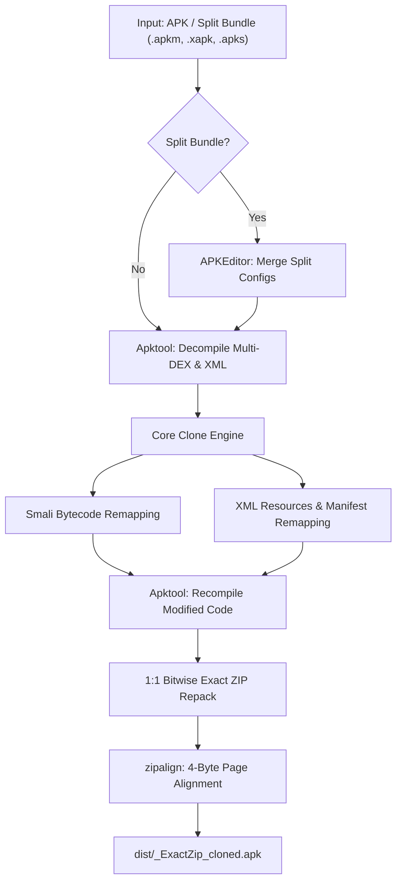

<div align="center">
  <h1>WhatsApp Clone Tool</h1>
  <p><b>Universal zero-dependency Python suite for cloning WhatsApp, WhatsApp Lite, Business & WAMODs.</b></p>

  <p>
    <a href="https://github.com/Towartz/wa-clone/releases"></a>
    <a href="https://github.com/Towartz/wa-clone"></a>
    <a href="https://github.com/Towartz/wa-clone/stargazers"></a>
    <a href="https://github.com/Towartz/wa-clone/network/members"></a>
    <a href="https://www.python.org/"></a>
    <a href="LICENSE"></a>
    
    
  </p>

  <p>
    <a href="#overview">Overview</a> •
    <a href="#key-features">Features</a> •
    <a href="#pipeline-architecture">Architecture</a> •
    <a href="#compatibility-matrix">Compatibility</a> •
    <a href="#installation--setup">Setup</a> •
    <a href="#usage-guide">Usage</a> •
    <a href="#command-line-reference">CLI Reference</a> •
    <a href="#configuration">Configuration</a> •
    <a href="#faq--troubleshooting">FAQ</a>
  </p>
</div>

---

## Overview

**WhatsApp Clone Tool** is an all-in-one APK cloning and repacking utility. It remaps package identifiers, Content Provider authorities, custom defined permissions, and resources across `.smali` bytecode and `.xml` files.

It includes an automated 1-click pipeline capable of taking an original APK or split App Bundle (`.apkm`, `.xapk`, `.apks`), merging split configurations, decompiling with Apktool, remapping bytecode, running a 1:1 bitwise exact ZIP repack, and applying 4-byte `zipalign`.

---

## Tutorial Video

<div align="center">
  <a href="https://www.youtube.com/watch?v=oYjPnrckKdk">
    
  </a>
  <br>
  <i>Click to watch the step-by-step video guide on YouTube</i>
</div>

---

## Key Features

- **Zero External Dependencies**: 100% pure Python standard library. Runs cleanly without installing external `pip` packages.
- **1-Click End-to-End Pipeline**: Directly supply an APK or split bundle to merge, decompile, clone, exact-repack, and 4-byte zipalign in a single step.
- **Split APK & App Bundle Merging**: Natively merges `.apkm` (APKMirror), `.xapk` (APKPure/Combo), `.apks` (Bundletool), and split APK directories using bundled `APKEditor.jar`.
- **Bundled Cross-Platform Tools Suite**: Contains pure Java binaries inside `./tools/`:
  - `apktool.jar` (v3.0.3)
  - `apksigner.jar` (Android SDK Build-Tools v37.0.0)
  - `APKEditor.jar` (v1.4.9)
  - `d8.jar` (Android SDK Build-Tools v37.0.0)
- **GitHub Releases Auto-Updater**: In-memory inspection and 1-click update engine (`--check-tools` / `--update-tools`) querying upstream GitHub releases.
- **Touch Screen & Mouse Navigation**: ANSI SGR 1006 mouse tracking support for touch screen taps (Termux Android) and mouse clicks (VSCode / Windows Terminal), alongside full keyboard controls.
- **Build-Only Fast Packaging Mode**: Bypass Dalvik bytecode and XML processing (`--build-only`) to quickly recompile and repack existing decompiled folders.
- **Dedicated Distribution Directory**: Output isolation in `./dist/` with automated intermediate build cleanup.
- **Content Provider Remapping**: Remaps 11+ Content Provider authorities (`accountswitching`, `mlkitinitprovider`, `orbitmessages`, etc.) preventing `INSTALL_FAILED_CONFLICTING_PROVIDER`.
- **Custom Permission Remapping**: Remaps custom defined permissions preventing `INSTALL_FAILED_DUPLICATE_PERMISSION`.
- **Multi-DEX Smali Traversal**: Recursively processes `smali`, `smali_classes2` through `smali_classes99`.
- **Official Module Protection**: Whitelist protects official Meta and WhatsApp submodules from namespace collision.

---

## Pipeline Architecture



---

## Compatibility Matrix

| Target Application | Default Base Package | Supported Input Formats | CPU Architecture Support | Status |
|---|---|---|---|---|
| WhatsApp Messenger | `com.whatsapp` | `.apk`, `.apkm`, `.xapk`, `.apks`, Folder | `arm64-v8a`, `armeabi-v7a`, `x86_64` | Supported |
| WhatsApp Business | `com.whatsapp.w4b` | `.apk`, `.apkm`, `.xapk`, `.apks`, Folder | `arm64-v8a`, `armeabi-v7a`, `x86_64` | Supported |
| WhatsApp Lite | `com.whatsapp.litex` | `.apk`, `.apkm`, `.xapk`, `.apks`, Folder | `arm64-v8a`, `armeabi-v7a`, `x86_64` | Supported |
| Custom WAMODs (GBWA, YoWA, FMWA) | Auto-Detected | `.apk`, Decompiled folder | `arm64-v8a`, `armeabi-v7a`, `x86_64` | Supported |

---

## Installation & Setup

### Prerequisites
- **Python**: Version 3.8 or higher.
- **Java**: Java Runtime Environment (JRE 8, 11, 17, or 21) for running tool JARs.

### Android Setup (Termux)
```bash
pkg update && pkg install python git openjdk-17 -y
git clone https://github.com/Towartz/wa-clone.git
cd wa-clone
```

### PC Setup (Windows / Linux / macOS)
```bash
git clone https://github.com/Towartz/wa-clone.git
cd wa-clone
```

---

## Usage Guide

### 1. Interactive Mode (Touch, Click & Keyboard)
```bash
python whatsapp_clone.py
```
The tool scans your workspace, detects candidate APKs and split bundles, and launches the interactive navigation menu.

### 2. 1-Click Automated Pipeline
```bash
# Clone directly from an APKM split bundle
python whatsapp_clone.py WhatsApp.apkm --mode 2 --package mywa --name MyWA

# Clone directly from an APK file
python whatsapp_clone.py base.apk --mode 2 --package mywa --name MyWA
```

### 3. Clone Pre-Decompiled Directory
```bash
python whatsapp_clone.py ./decompiled_base --mode 2 --package mywa --name MyWA --build --base-apk base.apk
```

### 4. Build-Only Fast Repack (Skip Cloning)
```bash
python whatsapp_clone.py ./decompiled_base --build-only --base-apk base.apk
```

### 5. Split Bundle Merging Only
```bash
python whatsapp_clone.py WhatsApp.apkm --merge-only
```

### 6. Tool Updates Inspector
```bash
# Check version status against GitHub releases
python whatsapp_clone.py --check-tools

# Download and upgrade tool JARs to latest releases
python whatsapp_clone.py --update-tools
```

---

## Command Line Reference

| Option | Description |
|---|---|
| `folder` | Path to root decompiled directory, `.apk` file, or split bundle (`.apkm`, `.xapk`, `.apks`) |
| `--whatsapp-type INT` | `1` = Standard WhatsApp, `2` = WhatsApp Business, `3` = Custom/Auto |
| `--mode INT` | `1` = Auto, `2` = Custom Package, `3` = Custom ALL, `4` = Build-Only |
| `--package STRING` | New package name without `com.` prefix (e.g. `towartz.wa`) |
| `--name STRING` | New storage folder name (e.g. `TowartzWA`) |
| `--search-pattern STRING` | Custom base search pattern to replace (Mode 3 only) |
| `--build` | Recompile with Apktool and package final 1:1 exact ZIP APK |
| `--build-only` | Skip cloning and repack decompiled folder directly |
| `--merge-only` | Merge split bundle into standalone APK and exit |
| `--base-apk FILE` | Path to base.apk template for 1:1 direct-copy repack |
| `--out-dir DIR` | Directory for output APKs (Default: `dist`) |
| `--out-apk FILE` | Custom output path for final cloned APK |
| `--sign` | Sign the output APK with apksigner (Default: unsigned) |
| `--keystore FILE` | Keystore path for signing |
| `--clean` | Force clean re-decompilation if folder exists |
| `--check-tools` | Check GitHub releases for tool updates |
| `--update-tools` | Automatically update tool JARs to latest releases |
| `-h, --help` | Display help message |

---

## Configuration (`config.txt`)

External tools and default options can be configured in `config.txt`:

```ini
# Paths to tool binaries (defaults to ./tools/ JARs)
APKTOOL_PATH=tools\apktool.jar
APKSIGNER_PATH=tools\apksigner.jar
SEVEN_ZIP_PATH=C:\Windows\system32\7z.exe
ZIPALIGN_PATH=C:\Android\build-tools\35.0.0\zipalign.exe

# Output and signing preferences
AUTO_SIGN=false
OUTPUT_DIR=dist
AUTO_CLEAN_BUILD=true
CHECK_TOOL_UPDATES=false
DEFAULT_WORKERS=12
```

---

## FAQ & Troubleshooting

### Why is the output APK unsigned by default?
Unsigned APK output is the default (`AUTO_SIGN=false`) because many users prefer signing with their own custom test keys, V2/V3 schemes, or via mobile tools like ApkToolM. To sign automatically with the built-in keystore, use `--sign` or set `AUTO_SIGN=true` in `config.txt`.

### How does 1:1 Direct-Copy Exact ZIP Repack work?
Standard Apktool recompilation creates new compression profiles that can cause WhatsApp native library verification to fail. The Direct-Copy engine unpacks compiled DEX files and manifests into the original APK structure with bitwise compression matching and 4-byte page alignment.

---

## Credits & License

- Core Python Implementation by YouTube@66XZD
- Distributed under the MIT License.

